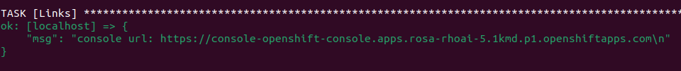

### RHOAI-DevEx-Mobb

This particular workshop chart works with the [iac-rhoai-on-cloud-services](https://github.com/cwooley-rh/iac-rhoai-on-cloud-services/blob/workshop_rhoai_devex/ansible/roles/create_workshop/tasks/main.yaml) repository.

It will need to be configured differently.  Locate the following file in the repository. `ansible/roles/create_workshop/tasks/main.yaml` and set the Workshop task to match the following.

Follow the rest of the instructions from [iac-rhoai-on-cloud-services](https://github.com/cwooley-rh/iac-rhoai-on-cloud-services/blob/workshop_rhoai_devex/ansible/roles/create_workshop/tasks/main.yaml).

### Bootstrapper Configuration

```yaml
- name: Workshop
  ...
  vars:
    ...
    workshop:
      chart:
        name: "rhoai-devex-mobb" # Set the base chart name
        repo: "https://poc-examples.github.io/workshops" # Use the poc-examples hosted workshop charts
        version: "0.1.16" # Current version is 0.1.16
        enabled: true
```

### Demo Workflow

#### Copy the Console Login Link



#### Login to OpenShift

Logging to OpenShift using the provided link and the set CLUSTER_USERNAME & CLUSTER_PASSWORD.

#### Follow the Video

[WorkShop Video Url](https://drive.google.com/file/d/1ZcXFgGMHzjSrecDw0aC-1IgDHdUWDors/view?usp=drive_link)